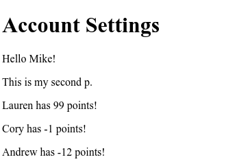

# Using React with Meteor Basics

## Imports
** Fill in later to have organized notes of React's import requirements **
**FOr NOW**
```jsx
import {Meteor} from 'meteor/meteor';

Meteor.startup(function () {
{/* Stuff */}
ReactDOM.render(jsx,document.getElementById('app'));
  })
```

The above is all that's necessary inside of `client/main.js` for it to work
*assuming therere's html with a properly ID'd div*

## Render Complex HTML with JSX
```jsx
import React from 'react';
import ReactDOM from 'react-dom';
import {Meteor} from 'meteor/meteor';

Meteor.startup(function () {
  let name = 'Mike';
  let jsx = <p>Hello {name}</p>;
  ReactDOM.render(jsx, document.getElementById('react-root'));
  })
```
- The above is a basic boiler plate for an explicit rendering of JSX
- `import {Meteor} from 'meteor/meteor'` is necessary to properly wrap the React app within the meteor framework
- At least one `ReactDOM.render(jsx,document.getElementById('app'))` is necessary inorder to have the React app actually rendering to the real DOM.
  - Effectively the element with id=`app` now encapsulates the entire React virtual DOM
- JSX is effectively JS with XML inside it that represents real HTML layouts
- JSX however cannot include adjacent elements at the root, only one root element can be returned by any render function from `ReactDOM`
  - **Note** this doesn't mean that nested elements can't be adjacent and in fact it is frequently required
```jsx
Meteor.startup(function () {
    // Render JSX stuff here...
    let name = 'Mike';
    let title = 'Account Settings';
    let jsx = (
      <div>
        <h1>{title}</h1>
        <p>Hello {name}!</p>
        <p>This is my second p.</p>
      </div>
    )
    ReactDOM.render(jsx, document.getElementById('react-root'));
});
```
- The above change shows a new page, with more complexity that's all wrapped inside a single jsx object, `jsx`
- **Note** all jsx objects can be wrapped inside `( ... )` parenthesis characters to define a multi-line block of JSX-based XML

## Render Data
- To start off, when handling basic data flows of React apps it's best to start with hand-programmed static data as `const`s within the app
- To start with for the score kepp app, create an array of dictionaries with 3 keys: `_id`, `name`, `score`
  - More on the underscored `_id` and what the underscore entails later
```jsx
const players = [{
  _id: '1',
  name: 'Lauren',
  score: 99
}, {
  _id: '2',
  name: 'Cory',
  score: -1
}, {
  _id: '3',
  name: 'Andrew',
  score: -12
}];
```
- This statically defined array can now be used to test how the React components handle data input
- For rendering the data in a really basic fashion start with a const global function inside of `app.js` to start rendering this data
```jsx
const renderPlayers= function () {
  return [<p key="1">1</p>, <p key="2">2</p>, <p key="3">3</p>];
};

// inside Meteor.startup()
...
{renderPlayers(players)}
...
```
- This simply returns an array through **array comprehension** *(more on that later)* and gives it back
- Map is a **REALLY** useful function to use in Javascript but in particular in React which has a few restrictions in program flow
- It basically just takes an iterable collection of objects, and a function as an argument, and returns the resulting collection, but with the argument function *mapped* to the resulting collection
- This is an example of how to apply a `-1` subtraction to all input numbers
```jsx
let newNumbers = numbers.map(function (number) {
  return number.val - 1;
});
```
- Now to use the map function to actually do some Reacet rendering
- Since the input values are going to be dynamically based off of the results of an input, and not defined as literals, a new JSX syntax is needed
  - `{ SOME_DYNAMIC_REFERENCES_OR VALS }`
  - The curly braces are used in JSX whenever dynamic values need to be obtained before actually rendering JSX.
  - The curly brackets allow for regular JS expressions to be run before retrieving a value for it to replace
  - In this case dynamic values need to be fetched before doing anything else
```jsx
import React from 'react';
import ReactDOM from 'react-dom';
import {Meteor} from 'meteor/meteor';

const players = [{
  _id: '1',
  name: 'Lauren',
  score: 99
}, {
  _id: '2',
  name: 'Cory',
  score: -1
}, {
  _id: '3',
  name: 'Andrew',
  score: -12
}];

const renderPlayers= function (playerList) {
  return playerList.map(function (player) {
    return <p key={player._id}>{player.name} has {player.score} points!</p>;
  });
};

Meteor.startup(function () {
    // Render JSX stuff here...
    let name = 'Mike';
    let title = 'Account Settings';
    let jsx = (
      <div>
        <h1>{title}</h1>
        <p>Hello {name}!</p>
        <p>This is my second p.</p>
        {renderPlayers(players)}
      </div>
    )
    ReactDOM.render(jsx, document.getElementById('react-root'));
});
```
- The above now handles all of this by rendering the static `players` array by using `renderPlayers`
- Now it's automated because `renderPlayers` uses the `map()` function to iterate the array
- Which should look like this 

## Arrow Functions
- Arrow functions are a very nice bit of syntactic sugar that helps to create function references that can be passed on to other code structures cleaning up a lot of code
```js
let square = function (x) {
  return x*x;
};
```
*the old way of handling anonymous functions*
- The above shows how to create anonymous functions using fully compatible Javascript
- This can be useful in some cases where functions need names
- Arrow functions **don't** support function names for these anonymous functions
- Below is the same function as an arrow function:
```js
let arrow_square = (x) => {
  return x*x;
};
```
*arrow syntax version of the same anonymous function*
- Why do this?
  - They support a simplified expressions syntax, which provides less syntax to simpler things that need to be done
  - They are more efficient for quick *throw-away* functions
  - The expression syntax can also be used inside any other expression due to its simplicity
```js
let arrow_square = (x) => x*x;
```
*Does the same thing, but now the expression can be embedded anywhere*
**TODO** add section 3 lecture 20 stuff on differences between ES6 & classic JS anon functions

## Refactoring For Arrows
- *Add for later maybe, hard to display this besides copying and pasting*
```js
import React from 'react';
import ReactDOM from 'react-dom';
import {Meteor} from 'meteor/meteor';
import {Players} from './../imports/api/players';
import {Tracker} from 'meteor/tracker';

const renderPlayers= (playerList) => {
  return playerList.map(function (player) {
    return <p key={player._id}>{player.name} has {player.score} point(s)!</p>;
  });
};

const handleSubmit = (e) => {
  let playerName = e.target.playerName.value;

  e.preventDefault();

  if (playerName) { //validate against empty strings
    e.target.playerName.value = '';
    //players insertion with a new score of '0'
   Players.insert({
     name: playerName,
     score: 0
   });
   console.log(Players.find().fetch());
  }
}

Meteor.startup(() => {
  // Create a players list 'players' by fetching from datastore
  players = Players.find().fetch();
  Tracker.autorun(() => {
    // Update players on datastore updates
    players = Players.find().fetch();

  // Moving this inside of the autorun, ensures that rendering occurs on update
    title = "Score Kepp";
    name = "Marcus"
    let jsx = (
      <div>
        <h1>{title}</h1>
        <p>Hello {name}!</p>
        <p>This is my second p.</p>
        <form onSubmit={handleSubmit}>
          <input type="text" name="playerName" placeholder="Player Name"/>
          <button>Add Player</button>
        </form>
        {renderPlayers(players)}
      </div>
    )
    ReactDOM.render(jsx, document.getElementById('react-root'));
  })
  // insert new doc into players collection
  //    exactly the same as in on server

});
```
*client/main.js refactored to properly use arrow functions*
- Above is a great example for how to refactor for arrow functions, it's just the previous `client/main.js` file but now with arrow functions instead
