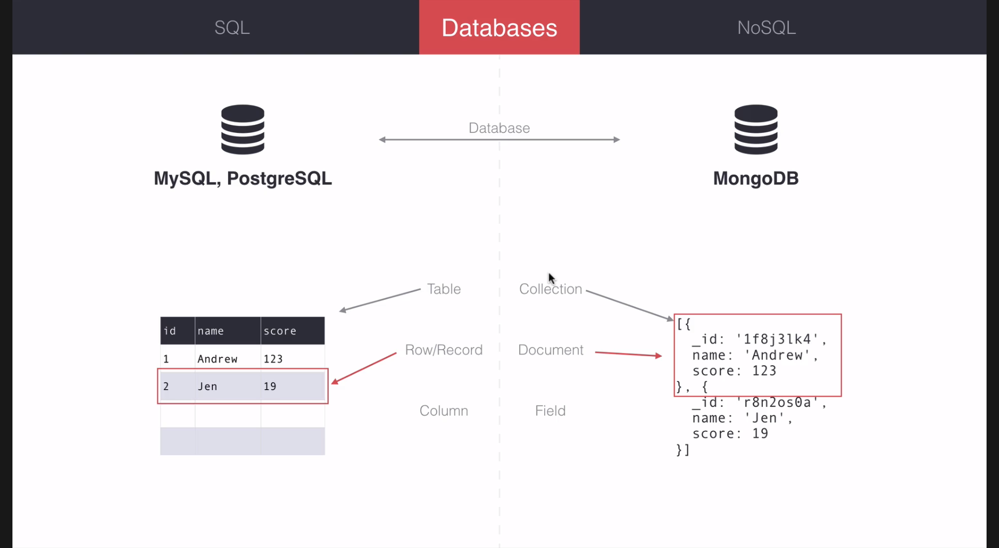

# Meteor with MongoDB Databses
- Meteor provides MongoDb by default to handle server located datastores
- Differs from standard SQL databses such as MySQL or PostgreSQL
- SQL has:
  - Tables, with records represented by columns and rows
  - Think pandas or excel
  - keys are represented in each columns
  - each row is each indexable object with their respective key-values in each rows
- NOSQL
  - A colleciton better represents the table
  - A document represents each row or records
  - A field is effectively the key and the column from before

*Some of the larger vocabulary differences of key SQL & NoSQL concepts*

## Your First MongoDB Collection
- using the code from before:
```jsx
import React from 'react';
import ReactDOM from 'react-dom';
import {Meteor} from 'meteor/meteor';

const players = [{
  _id: '1',
  name: 'Lauren',
  score: 99
}, {
  _id: '2',
  name: 'Cory',
  score: -1
}, {
  _id: '3',
  name: 'Andrew',
  score: -12
}];

const renderPlayers= function (playerList) {
  return playerList.map(function (player) {
    return <p key={player._id}>{player.name} has {player.score} points!</p>;
  });
};

Meteor.startup(function () {
    // Render JSX stuff here...
    let name = 'Mike';
    let title = 'Account Settings';
    let jsx = (
      <div>
        <h1>{title}</h1>
        <p>Hello {name}!</p>
        <p>This is my second p.</p>
        {renderPlayers(players)}
      </div>
    )
    ReactDOM.render(jsx, document.getElementById('react-root'));
});
```

- Using this code, some modifications will be made to create the same app, but by using MongoDB to manage the collection instead
- Since a decent amount of Javascript will be necessary to handle the ins and outs of the data base and its relationship to all the other parts of the app, it's common practice and useful to have a new folder created within `imports`, `imports/api`
- in this case, a file `players.js` file is going to be used to store all the players inside `imports/api/players.js`
- Inside this file there are only two lines needed for the time being:
```js
import {Mongo} from 'meteor/mongo';

export const Players = new Mongo.Collection('players');
```
- Not a lot, but very dense to unwrap:
    - `{Mongo}` is the `meteor` package that handles among other things creating and modifying stored MongoDB collections
    - `export`, remember the collection created needs to be exported to whatever imports this file
    - `Players` becomes the name used to reference this collection outside this file (by defualt)
    - `new` new is used inorder create  new copy of a collection as pulled from the...
    - `Mongo.Collection()` a function that takes in the collection name given as a string and returns it as a deserialised object that is now called `Players`
- All that's needed from `players.js` for now

### MongoDB is Usually for the Server
- Go to `server/main.js` to import `players.sj`
- As before, meteor needs to be loaded succesfully first before anything else can be done on the server *usually but not always*
- And also as before, include the `Meteor.startup(function() { ... });` line to handle the startup routines for the meteor server
- `Players.insert({ ...document stuff... })` is the `Collections` function that handles storing objects into a given collections' document data
```js
import {Meteor} from 'meteor/meteor'
import {Players} from './../imports/api/players';

Meteor.startup(function () {
   Players.insert({
     name: 'Andrew',
     score: 3
   });
   console.log(Players.find());
});
```
*a basic server/main.js file to handle a basic datastore player.js*
- We can't quite debug the new version of this site just yet because all the data rendering using this new Collections method of Mongo hasn't been implemented just yet
- Here, it's useful to take a look at a CLI helper program that can actually be viewed to directly view the Mongo database without any frontend implemented
- `meteor mongo` will run the cli for the mongo database, which by now shouhld have the new inserted entry, and maybe any duyplicates if it was saved more than once
- to see these entries use: `db.players.find()`
