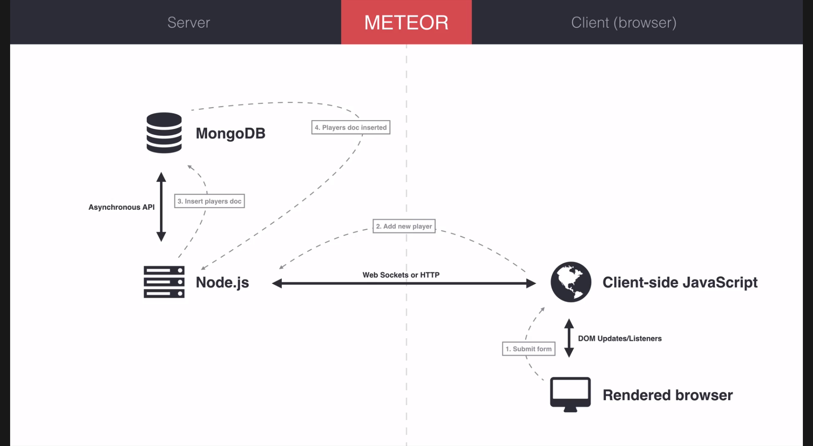

# Meteor with MongoDB Databses
- Meteor provides MongoDB by default to handle server-located datastores
- Differs from standard SQL databases such as MySQL or PostgreSQL
- SQL has:
  - Tables, with records represented by columns and rows
  - *think* pandas or excel
  - keys are represented in each columns
  - each row is each indexable object with their respective key-values in each rows
- NoSQL
  - A colleciton better represents the table
  - A document represents each row or records
  - A field is effectively the key and the column from before


*Some of the larger vocabulary differences of key SQL & NoSQL concepts*

## Your First MongoDB Collection
- using the code from before:
```jsx
import React from 'react';
import ReactDOM from 'react-dom';
import {Meteor} from 'meteor/meteor';

const players = [{
  _id: '1',
  name: 'Lauren',
  score: 99
}, {
  _id: '2',
  name: 'Cory',
  score: -1
}, {
  _id: '3',
  name: 'Andrew',
  score: -12
}];

const renderPlayers= function (playerList) {
  return playerList.map(function (player) {
    return <p key={player._id}>{player.name} has {player.score} points!</p>;
  });
};

Meteor.startup(function () {
    // Render JSX stuff here...
    let name = 'Mike';
    let title = 'Account Settings';
    let jsx = (
      <div>
        <h1>{title}</h1>
        <p>Hello {name}!</p>
        <p>This is my second p.</p>
        {renderPlayers(players)}
      </div>
    )
    ReactDOM.render(jsx, document.getElementById('react-root'));
});
```

- Using this code, some modifications will be made to create the same app, but by using MongoDB to manage the collection instead
- Since a decent amount of Javascript will be necessary to handle the ins and outs of the data base and its relationship to all the other parts of the app, it's common practice and useful to have a new folder created within `imports`, `imports/api`
- in this case, a file `players.js` file is going to be used to store all the players inside `imports/api/players.js`
- Inside this file there are only two lines needed for the time being:
```js
import {Mongo} from 'meteor/mongo';

export const Players = new Mongo.Collection('players');
```
- Not a lot, but very dense to unwrap:
    - `{Mongo}` is the `meteor` package that handles among other things creating and modifying stored MongoDB collections
    - `export`, remember the collection created needs to be exported to whatever imports this file
    - `Players` becomes the name used to reference this collection outside this file (by defualt)
    - `new` new is used inorder create  new copy of a collection as pulled from the...
    - `Mongo.Collection()` a function that takes in the collection name given as a string and returns it as a deserialised object that is now called `Players`
- All that's needed from `players.js` for now

### MongoDB in the Server
- Go to `server/main.js` to import `players.sj`
- As before, meteor needs to be loaded succesfully first before anything else can be done on the server *usually but not always*
- And also as before, include the `Meteor.startup(function() { ... });` line to handle the startup routines for the meteor server
- `Players.insert({ ...document stuff... })` is the `Collections` function that handles storing objects into a given collections' document data
```js
import {Meteor} from 'meteor/meteor'
import {Players} from './../imports/api/players';

Meteor.startup(function () {
   Players.insert({
     name: 'Andrew',
     score: 3
   });
   console.log(Players.find());
});
```
*a basic server/main.js file to handle a basic datastore player.js*
- We can't quite debug the new version of this site just yet because all the data rendering using this new Collections method of Mongo hasn't been implemented just yet
- Here, it's useful to take a look at a CLI helper program that can actually be viewed to directly view the Mongo database without any frontend implemented
- `meteor mongo` will run the cli for the mongo database, which by now shouhld have the new inserted entry, and maybe any duyplicates if it was saved more than once
- to see these entries use: `db.players.find()`
- Now, it's possible to persist app sessions between tabs, broken connections, or just plain shutting the tab down eating dinner and returning

## Mini-Mongo & Client-Side Caching
- The Traditional Architecture is to have a Web-Server with datastore server-side



- There is a problem with this Architecture
  - Whenever data is required to update the view of the web app, it needs to be requested across a potentially giant pipeline across the internet, processed on a potentially overloaded server, sent back across that pipeline, potentially re-rendered on the front end
- To get around this weakness, a new type of architecture can be used to improve the UX
- In meteor there exists a standard way to maintain a client-side cache
- What this means is that required data is a cloned between a datastore on the server **and** client
- This is **Mini-Mongo**, and it can also exists entirely on RAM
- Now instead of communicating with the server, if the data exists locally, which it should already if good caching is implemented, it will just have to access the data locally in RAM
-  Way faster access times
- Data just needs to be transferred asynchronously with the server to keep both databases consistent with each other
### DDP - Distributed Data Protocol
- Used to sync up distributed databases
- The meteor client side code, will automatically make DDP requests to clone the databases, for example if in the score-keep app the user adds a player, when the client is relatively load-free, it will send in that request to the server
- DDP will also send back responses if for example, adding that player fails
- With this approach the response times of the app is significantly reduced because now, most of the data used comes from the client store


### Implementing DDP in Code
- When the same code that was used on the server is used in the client, the same thing happens, but as a mini-mongo server instead that is stored in client memory
- So inside of `client/main.js`, just import `players.js` **the same way** as in `server/main.js`
  - Saved, this results in the client console have an empty array listed, because there's no data added yet
  - This means that the data has not beeen synced between client & server yet
- If the client is forced to wait 1 second before rendering players, it should result in seeing the data render slower
- Now there is a player list visible, and with one more than what was created on the client
- Because there's another player added from the server that just synchronized with the client, there's now an extra one being console logged
  - which can be done with a quick change to the console function, telling it to wait 1000ms
- Now let's use `tracker` to track queries to datastores, and track when data should  be rendered again because there's new data to show
- `import {Tracker} from 'meteor/tracker';`
  - This imports the tracker class to help with tracking these data updates
```js
Tracker.autorun(function() {
  console.log('Players list: ', Players.find().fetch());
});
```
  - The above should show how the changes in the local database occurs, by tracking the playerslist before synchronization and after
  - There should be an empty array and then a populated one afterwords
- Now to rewrite the app so that it properly utilizes the DPP and renders the data whenever it updates
- Below is the rewrite of `client/main.js` to render with DPP:
```js
import React from 'react';
import ReactDOM from 'react-dom';
import {Meteor} from 'meteor/meteor';
import {Players} from './../imports/api/players';
import {Tracker} from 'meteor/tracker';

const renderPlayers= function (playerList) {
  return playerList.map(function (player) {
    return <p key={player._id}>{player.name} has {player.score} point(s)!</p>;
  });
};

Meteor.startup(function() {
  // Create a players list 'players' by fetching from datastore
  players = Players.find().fetch();
  Tracker.autorun(function () {
    // Update players on datastore updates
    players = Players.find().fetch();

  // Moving this inside of the autorun, ensures that rendering occurs on update
    title = "Score Kepp";
    name = "Marcus"
    let jsx = (
      <div>
        <h1>{title}</h1>
        <p>Hello {name}!</p>
        <p>This is my second p.</p>
        {renderPlayers(players)}
      </div>
    )
    ReactDOM.render(jsx, document.getElementById('react-root'));
  })
  // insert new doc into players collection
  //    exactly the same as in on server

   Players.insert({
     name: 'Mike Hunt',
     score: 69
   });
   console.log(Players.find().fetch());
});
```
- A new variable for `main` is created `players` used to track the current list of players
- This is initialized by a fetch to the local database
- Then `Tracker.autorun()` is used to update that `players` list whenever DPP detects changes
- After `players` is updated by `Tracker`, next it's time to re-render the DOM to reflect these changes, otherwise it's just going to render whenever the page is reloaded
- Previously in `server/main.js` a static player was added to the database, which is still getting persisted into the client, remove that, then add static insertions into the client isntead
- To add it to the client instead, simply copy and paste the same code into the client
- Now the client should be rerndering a bunch of players that have been persisted over the testing runs of the app, this will be changed later to make the app run as intended


*How the test site renders, using the new DPP implementing code above*

## Inserting Dynamic Data Using Forms
- Now to dynamically add data to the databases using view elements known as **forms**
- First, create a form that is a simple text box with submit button
- First up, use the `<form>` tag to generate an input form
- Inside the `form` tag, nest in the input elements needed
  - `<input type="text" name="playerName" placeholder="Player Name"/>
    - this creates a `"text"` input box, referenced as `playerName` with placeholder text "Player Name"
  - `<button>Add Player</button>`
    - Simply adds an adjacent button in the layourt without any callbacks
  - By adding an `onSubmit` react attribute in the form of a callback function, it's possible to handle the actions that need to happen when the button is pushed
    - change the form to: `<form onSubmit={handleSubmit}>`
    - now `handleSubmit` simply needs to be implemented to handle the reaction to clicking on the submit button tied to that form
  - Event handlers always get called with an argument, which is needed to access the information about that form, usually the argument is given as `e` for **e** vent handler.
    - `e.preventDefault();` should be added as the first action in this case because it prevents a page refresh from occuring, which isn't really necessary since that is handled by `autorun` for when real changes need to be displayed
  - Now to store the data submitted through the form:
```js
const handleSubmit = function (e) {
  let playerName = e.target.playerName.value;

  e.preventDefault();

  if (playerName) { //validate against empty strings
    e.target.playerName.value = '';
    //players insertion with a new score of '0'
   Players.insert({
     name: playerName,
     score: 0
   });
   console.log('Submit player "', playerName, '" of new score 0');
  }
}
```
*handleSubmit(e) implementation*
- So now due to the chain of events that occurs from submiting data on the form, to calling `handleSubmit`, to inserting the new named player, to autorun re-rendering due to new data, the page handle's adding new data
  - `e` is a standard name for the event that gets passed into the callback whenever an event callback is called
    - `e` among other things contains the data submitted within the form specified by the form's atrribute `name="playerName"`
    - `e.target` contains the callback objects that the even originated from
  - `onSubmit` calls `handleSubmit` with the event handler as its argument
  - `e.preventDefault` stalls the default browser behavior for input forms since the information is going to be handled by javascript instead now
  - `if(playerName)` is a very easy way to validate against empty submissions
    - It's easy to forget that the event handler needs to reset the field here's how:
      - `e.target.playerName.value = '';`
    - To insert new players based off of the form input, simply cut and paste the code used to enter static players in the client into the event handler and change the value inserted into `name: ` to be `playerName` as taken from the form
- Now the client should be properly handling player submissions with basic validation, and that data should also be getting update both locally and on the server


*client implementation of form submission to local & remote databases*
- Now it should be obvious that another form of data handling is going to be necessary
  - There's now tons of junk data that has been submitted to the databases for testing the initial steps of development
- For now, let's clear the databases of this junk static data for a clean slate to work with
- Using the terminal it's possible to clear the database:
  - **NOTE** meteor needs to be down for this
  - `meteor reset` clears the databases properly when it's not running
  - now after waiting for the new build to get served up (*can take a bit*) there should be a clear page ready to have dynamically added data
- Cool **note**, if another tab is used, adding new players, means the same data gets rendered on either of the tabs without refreshes


## Removing Documents from Collections
- Objectives
  - How to remove a document?
  - How to remove a *particular* document?
  - How to add a button with a click event?
- Targeting docs and removing them
  - Halt the server
  - bring up mongo: `meteor mongo`
    - inside, `db.players.find()` brings up all players
    - to select one, `db.players.find({name: 'Marcus'})`
      - This matches all queries that have `'Marcus'` in the key `name`
    - to remove, `db.players.remove({_id: 'ID_STRING'})` deletes a specific entry by its unique ID but it could be as a general query for all matches of a key:value pair.
- Now to perform these steps from a button's click event
  - go to `client/main.js`:
```js
// inside renderPlayers function
<p key={player._id}>
  {player.name} has {player.score} point(s)!
  <button onClick={() => {
    Players.remove({_id: player._id});
  }}>X</button>
</p>
```
  - This modification to the `renderPlayers` function so that it has a `<button>` with click event `onClick` has an arrow function to handle the database remove function
  - It is complex due to the levels of nesting and newly learned concept of the arrow function, but what's important is this line:
    - `Players.remove({_id: player._id});`
    - `remove()` is the same as in the terminal prompt to remove entries
      - using queries inside `{...}`
      - `_id` is the key to match for removal
      - `player._id` is passed as an arrow expression from its parent which knows which player is currently in question, to remove based on its `_id`
- Testing this modification should result in the players being removed, and not how because all the data rendering being handled properly before means that now these changes are easily handled separately from how the data is being handled **revise**

## Updating Documents
- In the **CRUD** schema which is so common for web apps, the third operation is **U** pdate, which allows to change properties of a document *(object)* without adding or removing from the collection
-  In the database, *with meteor running*
  - `db.players.update({_id: 'ID_STRING'}, {name: 'Summer'})`
  - This is actually not that useful because it creates a new copy of the same object, but with a changed name, and by consequence, the score and id are new
  - Not terribly useful, there's better ways to handle update operations
  - Mostly **field operators**
  - From [Mongo's documentation][2], there's a useful extra operator that allows setting fields within a document directly without the weird behavior from before
  - `db.players.update({_id: 'ID_STRING'}, {$set: {score: 1000}})`
    - this sets the field `score` to 1000 for whatever item has `_id` of ID_STRING
  - There are tons of other useful update operators, like `$inc` which works much the same as `$set` but instead it specified by how much to increment
  - For more update operators check the [MongoDB Documentation][2]

### Implementing Data Updates in App
- Objectives:
  - Add button for Updates
  - Add `onClick` with event handler to update that player's score
  - Have event handler update score by 1
- Using the new update operator attempted on the terminal, `$inc`, add another button that is meant to increment the score of that player
- Give it an `onClick` attribute that is an arrow function that uses the update operator `$inc` to properly increment the score of that player
```js
// inside renderPlayers, inside of the <p> tag...
<button onClick={ () => {
  Players.update({_id: player._id}, {
    $inc: {score: 1}
  });
}}>+1</button>
// remove player button...
```
- This, just like in the console, will update the player score by incrementing it by one
- Then data flow is the same as for removing a player:
  - Clicking the **+1** button triggers the `onClick` event handler of the button
  - The `onClick` event references the given arrow function as the event handler
  - That arrow function uses `Players.update({_id: player._id}, {$inc: {score: 1}})` in order to call on the mongo functions defined in `players.js` to increment that players score
  - That player's score is known because all these things were defined together in the same set of html tags, so because they are all together within the virtual DOM, it's easy to access that information to make the update operation possible
- The same can now easily be done to add a decrements button to decrease score
```js
<button onClick={ () => {
         Players.update({_id: player._id}, {
           $inc: {score: -1}
         });
       }}>-1</button>
```
*A decrements button that properly updates player objects*
- Now to help track progress, here's the current version of the `client/main.js` file, completing this section which covered basic react and meteor cooperation (exterior document), and in this one CRUD implementations to render data using mongodb with react and meteor


## References
[1]: https://docs.mongodb.com/
- MongoDB Documentation Index: [1][1]

[2]: https://docs.mongodb.com/manual/tutorial/update-documents/index.html
- MongoDB Docs: Update Operators: [2][2]
