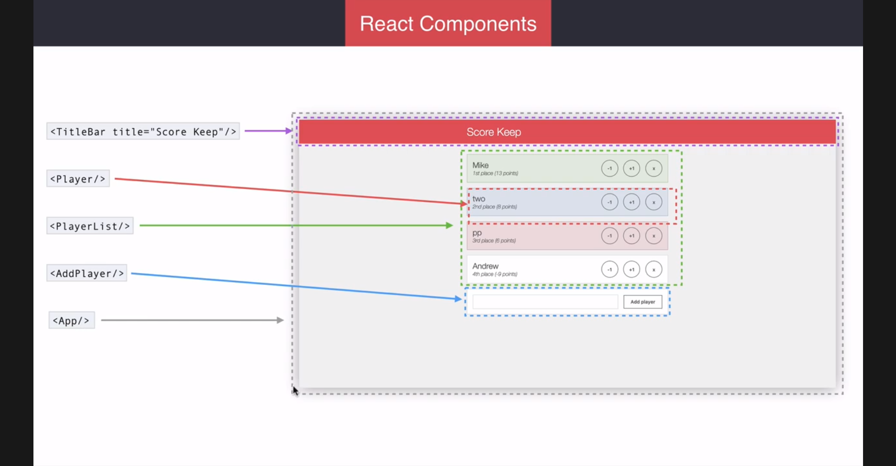
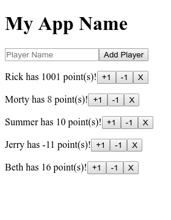

# React components
- So far the app has been implemented inside the `client/app.js`
- This is useful for visualizing and quickly implementing functionality
- Problem is...
  - Not maintainable
  - Not Scalable
  - Not Testable
  - Not Easy for others to modify
- As apps get more complex, so does that file, so to improve its organization it will be broken up into other files of **React Components**
- Think of components as complex HTML tags
- In react they get used in much the same way
- React components can have functions, variables, classes, etc.
- `<AddPlayer/>` is such a components that is going to be defined
- Instead of that giant mess inside `client/main.js` all of that functionality gets encapsulated into that one self-closing tag
- And all that's needed by the class, function, app that's using it is to import it

## Designing Components
- Before designing an app it helps a lot to create wireframes and logically seperate parts of it into named components that will later be implemented
- In Scorekeep, a `TitleBar` will be needed
- **props** are the *reactive* way of passing HTML-like attributes into React components as one way arguments that are needed to render the component
- `<PlayerList/>` will render a list of `<Player/>`s
- `<Player/>` is each individaul item that the list will render
  - Renders
    - `playerName`
    - `score`
    - `ranking`, based off relative scores
    - the three previously used CRUD buttons needed for each player
- The `AddPlayer` Form
- `App` which contains the entirety of the application and lays out subordinate components


*Overview of Score-Keep App Design with Annotations for React Components*


## Creating Data Model Classes to Store Component Data
**SKIP**
*implement for future articles on teaching react and OOP js*

- In `server/main` lets modify the code so that there's classes that store all the relevant data for each component, starting with `Person`
- `class Person {}` to start with
- Testing this by instantiating the class with `let me = new Person()` just gives an empty class
- To fill in this data, a `constructor` is needed to initialize that class instance
  - everything inside gets called when the instance is created and is then referable later
  - `this` is a keyword that always means that the current scope's instance of something being referenced is the level of scope interested in
    - This contrasts from other situations where for example you pass the constructor a value with the same name, you'd differentiate the reference for the instance by `this`
  - In the arguments list, just like python, if the argument is assigned within the arguments list, that becomes the default value
    - If no argument is provided, then that default is used instead
```js
class Person {
  constructor(name = 'Anonymous') {
    this.name - name;
  }
}
```
- Now let's create some helper function for debugging `Person`, `getGreeting`
```js
getGreeting() {
  return `Hi, I'm ${this.name}.`;
}
```
- Now, all that's needed to debug an instance of `Person` is to: `me.getGreeting()`
```js
class TitleBar extends React.Component {
  render() {
    return (
      <div>
        <h1>My App Name</h1>
      </div>
    );
  }
}
```


## Breaking an App into Components
- Using the previously implemented `client/main.js`, breakup all relevant parts into the previously defined react Components
- First component will be implemented in `client/main` and then moved to its own class file
- This will be the `TitleBar` class
```js
// previous stuff above startup()...

//TitleBar definition
class TitleBar extends React.Component {
  render() {
    return (
      <div>
        <h1>My App Name</h1>
      </div>
    );
  }
}

Meteor.startup(() => {
  // Create a players list 'players' by fetching from datastore
  players = Players.find().fetch();
  Tracker.autorun(() => {
    // Update players on datastore updates
    players = Players.find().fetch();

    let jsx = (
      <div>
        <TitleBar/>
        <form onSubmit={handleSubmit}>
          <input type="text" name="playerName" placeholder="Player Name"/>
          <button>Add Player</button>
        </form>
        {renderPlayers(players)}
      </div>
    )
    ReactDOM.render(jsx, document.getElementById('react-root'));
  })
});
```
*Update to client/main to Render a TitleBar as its own defined react component*
- Now taking the previous version of `client/main` and replacing the previous testing junk above the including the `<h1>` & `<p>` tags, with `<TitleBar/>`, now this gets rendered up top in the app...



- With it confirmed working, time to create a new file for it to live in
- First, let's do some folder structure refactoring
  - `imports/ui` is a good structure to maintain for React UI components
  - create the folder and then create a class file, `TitleBar.js` inside
- Then copy and paste the contents of TitleBar definiton from `client/main` into it
```js
import React from 'react';
export default class TitleBar extends React.Component {
  render() {
    return (
      <div>
        <h1>My App Name</h1>
      </div>
    );
  }
}
```
*imports/ui/TitleBar.js*
- Just remember, each file needs to maintain its own imports
  - In this case only `React` is needed to be able to extend a React `Component`
- Also, it's easy to forget that each class needs to be exported
  - It's a simple class so simply `export` it by its definition
  - Also, it's a fairly simple class, so it makes sense to make it `default`
- Then finally import the class in `client/main`

### Create AddPlayer
- Let's get rid of everything inside & including the `<form>` tag that defined the rendering of the add player input area
- For now, just give it a placeholder tag, like an `<h3>` with some text, it will be fleshed out later
  - **props** & **callback functions** will be necessary to get the form to work properly
`imports/ui/AddPlayer.js` (dummy version):
```js
import React from 'react';

export default class AddPlayer extends React.Component {
  render() {
    return (
      <div>
        <h3>AddPlayer</h3>
      </div>
    );
  }
}
```

## Props & Proptypes & Prop Defaults
- Inorder to make components flexible in how they're used, props are needed as data that gets passed into the component so that it renders desired information the way that component is designed to
- Take `TitleBar` for example
  - Right now it only renders *"Score Keeper"* as its text for the title area
  - What if something else was desired?
  - props are needed to pass another string into it
- Refactor `TitleBar` to have prop `title`

`imports/ui/Titlebar.js` *title prop*
```js
<h1>{this.props.title}</h1>
```
`client/main.js` *use TitleBar with title prop*
```js
// ...
<TitleBar title="Score Keep"/>
// ...
```
- Ideally, nothing should be changed after saving these changes
  - Because the same string is being passed through as a **prop** `title` in `TitleBar` when it's getting used in `client/main` and referenced as `{this.props.title}`
  - `{this.props.title}` is the pattern used to reference props by a key `title` when they're passed into this component by its parent
  - **Remember** `this` refers to the instance being used

### Type Checking Props
**NOTE**: React has deprecated this kind of proptypes object, in future look up how to import and use `prop-types` instead. Syntactically they should be largely the same
- React [Docs](http://bit.ly/2xjetQo) covers this well
  - If specifics on type specifiers for props are needed use this page as a reference
`TitleBar.js` *with basic proptype definition for strings*
```js
TitleBar.propTypes = {
  title: React.PropTypes.string.isRequired
}
```
- This will create a prop restriction for strings so react will automatically validate the kinds of data sent into the prop
  - If in `client/main` the prop `title` isn't given to `TitleBar` then it will throw an error about its propType, since `NULL/undefined` is what is assigned to it if it's never given
- `isRequried` makes sure that properties are passed through by giving the react console an error when it doesn't get detected
- `defaultProps` is what's used when a placeholder value is desired, like when a prop isn't given
  - change `title`s `isRequired` or remove it and give it a default of "Default Title" by refactoring its prop definitions like so:
```js
TitleBar.propTypes = {
  title: React.PropTypes.string.isRequired
}
```
- Now the title should show up as **"Default Title"** instead

### Type Checking Done Right (prop-types)
**CONTINUE HERE**
